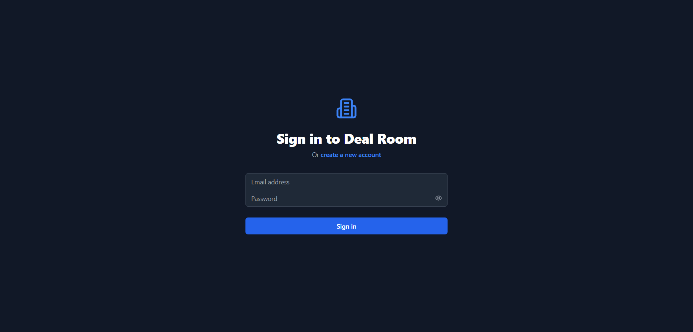
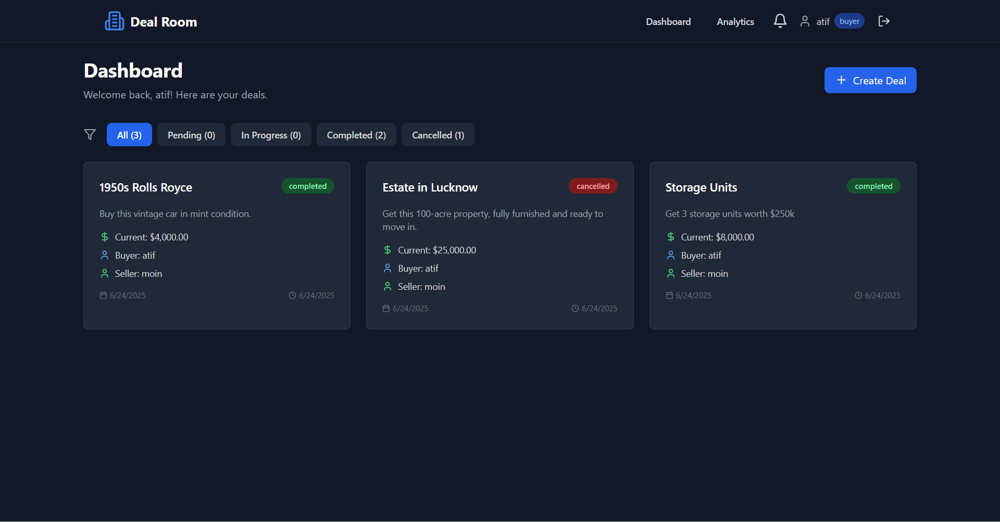
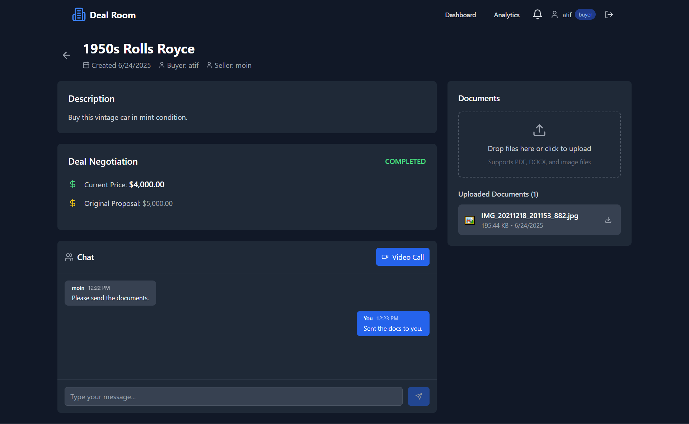
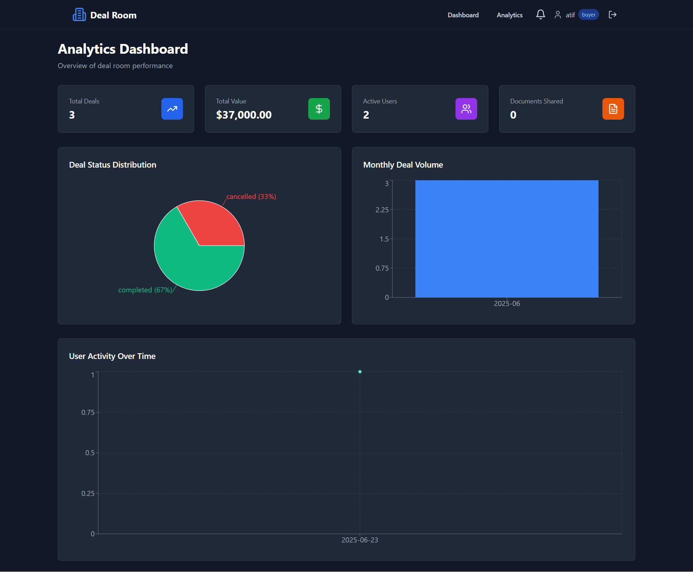

# Deal Room - Deal Negotiation Platform

## Video Demonstration

[Part 1](https://www.loom.com/share/fe64b5d2d6334a53b1ab3b6184cf44de?sid=eee943aa-d9e8-4d2f-b572-b2f7668422af)

[Part 2](https://www.loom.com/share/54c2de7df919401f919f8a69f381aeee?sid=6c7e0580-2c68-431a-92e1-49dc648fcf64)

## Deployed Link

[Deal Room (Vercel)](https://deal-room-eta.vercel.app)

## Pdf Report

[PDF Report](https://docs.google.com/document/d/1yCxFFndhKo31wD6J-wZk9xmrZFkysYphDGdToagd3_o/edit?usp=sharing)

## Test Credentials

Buyer Account:

```
email: atif@gmail.com
password: atif123
```

Seller Account:

```
email: moin@gmail.com
password: atif123
```

## Description

A comprehensive virtual deal room application that enables buyers and sellers to engage in real-time negotiations, securely share documents, communicate through integrated chat, and conduct video calls for live deal discussions.

## Features

### 🔐 Authentication & User Management

- JWT-based authentication with secure session management
- Role-based access control (Buyer/Seller)
- Redis-powered session storage for enhanced performance

### 💼 Deal Management

- Create, negotiate, and manage deals with real-time updates
- Deal status tracking (Pending, In Progress, Completed, Cancelled)
- Price negotiation with counter-offer functionality
- Complete deal history and negotiation timeline

### 💬 Real-Time Communication

- Integrated chat system with Socket.IO
- Message history and persistence

### 📄 Document Management

- Secure document upload and sharing
- Support for PDF, DOCX, and image files
- Document download and management

### 📊 Analytics Dashboard

- Real-time deal statistics and performance metrics
- User activity tracking and engagement analytics
- Visual charts and data visualization with Recharts

### 📹 Video Calling

- ...To be implemented

## Technology Stack

### Frontend

- **React 18** with TypeScript
- **Redux Toolkit** for state management
- **Socket.IO Client** for real-time communication
- **WebRTC APIs** for video calling
- **Tailwind CSS** for styling
- **Recharts** for data visualization
- **Lucide React** for icons

### Backend

- **Node.js** with Express.js
- **Socket.IO Server** for real-time features
- **MongoDB** with Mongoose ODM
- **Redis** for caching and session management
- **JWT** for authentication
- **Multer** for file uploads
- **Joi** for data validation

## Installation

1. **Clone the repository**

   ```bash
   git clone https://github.com/iamatifmoin/Deal-Room.git
   cd Deal-Room
   ```

2. **Install dependencies**

   ```bash
   npm run setup
   ```

3. **Environment Configuration**

   Create `.env` file in the root directory:

   ```bash
   cp .env.example .env
   ```

   Create `server/.env` file:

   ```bash
   cp server/.env.example server/.env
   ```

   Update the environment variables with your configuration:

4. **Start the application**

   ```bash
   npm run dev
   ```

   This will start both the frontend (http://localhost:5173) and backend (http://localhost:5000) servers concurrently.

## Project Structure

```
Deal-Room/
├── src/                          # Frontend source code
│   ├── components/              # React components
│   │   ├── Analytics/          # Analytics components
│   │   ├── Auth/               # Authentication components
│   │   ├── Chat/               # Chat functionality
│   │   ├── Dashboard/          # Dashboard components
│   │   ├── Deal/               # Deal management
│   │   ├── Documents/          # Document handling
│   │   ├── Layout/             # Layout components
│   │   └── Video/              # Video call components
│   ├── hooks/                  # Custom React hooks
│   ├── pages/                  # Page components
│   ├── services/               # API and Socket services
│   ├── store/                  # Redux store and slices
│   └── types/                  # TypeScript type definitions
├── server/                      # Backend source code
│   ├── config/                 # Configuration files
│   ├── controllers/            # Controller files
│   ├── middleware/             # Express middleware
│   ├── models/                 # MongoDB models
│   ├── routes/                 # API routes
│   └── socket/                 # Socket.IO handlers
└── README.md
```

## API Endpoints

### Authentication

- `POST /api/auth/register` - User registration
- `POST /api/auth/login` - User login
- `GET /api/auth/me` - Get current user

### Deals

- `GET /api/deals` - Get user's deals
- `POST /api/deals` - Create new deal
- `GET /api/deals/:id` - Get deal details
- `PATCH /api/deals/:id/accept` - Accept deal
- `PATCH /api/deals/:id/counter` - Submit counter offer
- `PATCH /api/deals/:id/complete` - Complete deal

### Documents

- `POST /api/deals/:id/documents` - Upload documents
- `GET /api/documents/:id/download` - Download document
- `DELETE /api/documents/:id` - Delete document

### Analytics

- `GET /api/analytics` - Get analytics data
- `GET /api/analytics/user` - Get user-specific analytics

## Socket Events

### Chat

- `joinDeal` - Join deal room
- `sendMessage` - Send message
- `newMessage` - Receive new message
- `startTyping` / `stopTyping` - Typing indicators

### Video Calls

- `initiateVideoCall` - Start video call
- `videoCallOffer` - WebRTC offer
- `videoCallAnswer` - WebRTC answer
- `iceCandidate` - ICE candidate exchange
- `endVideoCall` - End video call

## ScreenShots

Authentication:


Dashboard:


Deal:


Analytics:

